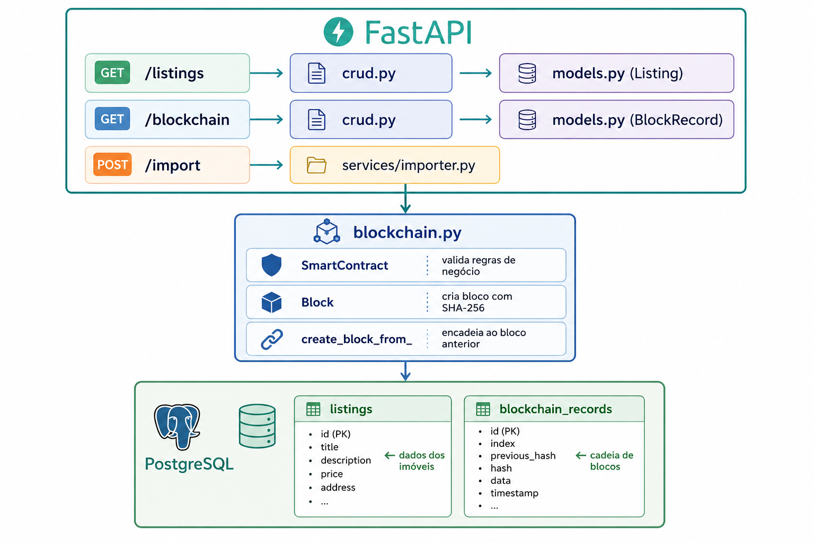
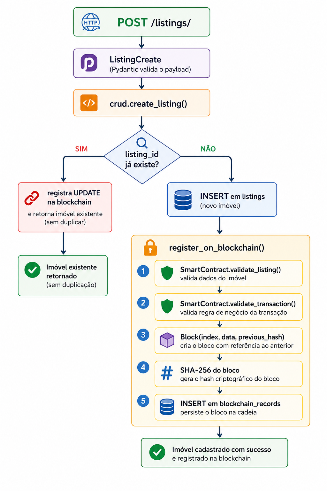

# 🏠 Blockchain Imobiliária

API REST para o mercado imobiliário com conceito de **blockchain** e **smart contracts**, construída com FastAPI e Python. Os dados são importados do dataset ZAP Imóveis e persistidos no PostgreSQL, com cada transação registrada em uma cadeia de blocos imutável.

---

## 📋 Índice

- [Visão Geral](#visão-geral)
- [Tecnologias](#tecnologias)
- [Arquitetura](#arquitetura)
- [Estrutura do Projeto](#estrutura-do-projeto)
- [Pré-requisitos](#pré-requisitos)
- [Instalação e Execução](#instalação-e-execução)
- [Endpoints](#endpoints)
- [Exemplos de Uso](#exemplos-de-uso)
- [Blockchain e Smart Contracts](#blockchain-e-smart-contracts)
- [Importação de Dados](#importação-de-dados)
- [Logs no Terminal](#logs-no-terminal)
- [Acessando o pgAdmin](#acessando-o-pgadmin)

---

## Visão Geral

O sistema combina três conceitos principais:

- **Imobiliária**: gerenciamento de anúncios de imóveis com filtros por cidade, tipo de negócio e faixa de preço.
- **Blockchain**: cada imóvel registrado ou atualizado gera um bloco com hash SHA-256, encadeado ao bloco anterior, garantindo rastreabilidade e imutabilidade.
- **Smart Contract**: antes de qualquer registro na cadeia, regras de negócio são validadas automaticamente (preço, área, localização), simulando o comportamento de contratos inteligentes.

---

## Tecnologias

| Tecnologia | Versão | Uso |
|---|---|---|
| **Python** | 3.12+ | Linguagem principal |
| **FastAPI** | 0.111.0 | Framework web e documentação automática |
| **SQLAlchemy** | 2.0.30 | ORM para mapeamento objeto-relacional |
| **PostgreSQL** | 16 | Banco de dados relacional |
| **Pydantic** | 2.7.1 | Validação de dados e schemas |
| **pydantic-settings** | 2.3.0 | Gerenciamento de configurações via `.env` |
| **Pandas** | 2.2.2 | Leitura e parsing do CSV |
| **Uvicorn** | 0.30.1 | Servidor ASGI |
| **Docker / Docker Compose** | — | Infraestrutura do banco de dados |
| **Alembic** | 1.13.1 | Migrações de banco de dados |
| **hashlib (stdlib)** | — | Geração de hashes SHA-256 para os blocos |

---

## Arquitetura



```
┌─────────────────────────────────────────────────────────┐
│                        FastAPI                          │
│                                                         │
│  /listings  ──►  crud.py  ──►  models.py (Listing)     │
│  /blockchain ──► crud.py  ──►  models.py (BlockRecord)  │
│  /import    ──►  services/importer.py                   │
└────────────────────────┬────────────────────────────────┘
                         │
              ┌──────────▼──────────┐
              │    blockchain.py    │
              │                     │
              │  SmartContract      │  ← valida regras de negócio
              │  Block              │  ← cria bloco com SHA-256
              │  create_block_from_ │  ← encadeia ao bloco anterior
              └──────────┬──────────┘
                         │
              ┌──────────▼──────────┐
              │     PostgreSQL      │
              │                     │
              │  listings           │  ← dados dos imóveis
              │  blockchain_records │  ← cadeia de blocos
              └─────────────────────┘
```

### Fluxo de um registro



```
POST /listings/
      │
      ▼
  ListingCreate (Pydantic valida o payload)
      │
      ▼
  crud.create_listing()
      │
      ├── listing_id já existe? ──► registra UPDATE na blockchain
      │                             e retorna imóvel existente (sem duplicar)
      │
      └── listing_id novo? ──► INSERT em listings
                                    │
                                    └──► register_on_blockchain()
                                              │
                                              ├──► SmartContract.validate_listing()
                                              ├──► SmartContract.validate_transaction()
                                              ├──► Block(index, data, previous_hash)
                                              ├──► SHA-256 do bloco
                                              └──► INSERT em blockchain_records
```

---

## Estrutura do Projeto

```
blockchain/
├── app/
│   ├── __init__.py
│   ├── main.py              # Inicialização do FastAPI e criação das tabelas
│   ├── config.py            # Configurações via pydantic-settings e .env
│   ├── database.py          # Engine SQLAlchemy e sessão
│   ├── models.py            # Modelos ORM: Listing e BlockchainRecord
│   ├── schemas.py           # Schemas Pydantic para request/response
│   ├── crud.py              # Operações de banco + integração blockchain
│   ├── blockchain.py        # Block, SmartContract, hashing SHA-256
│   ├── routers/
│   │   ├── __init__.py
│   │   ├── listings.py      # Endpoints de imóveis
│   │   ├── blockchain.py    # Endpoints de blockchain
│   │   └── importer.py      # Endpoints de importação CSV
│   └── services/
│       ├── __init__.py
│       └── importer.py      # Lógica de parsing, importação e streaming SSE
├── data/
│   └── dataZAP.csv          # Dataset ZAP Imóveis
├── .env                     # Variáveis de ambiente (não versionar em produção)
├── .env.example             # Exemplo de variáveis de ambiente
├── docker-compose.yml       # PostgreSQL + pgAdmin
├── requirements.txt         # Dependências Python
└── README.md
```

---

## Pré-requisitos

- Python 3.12+
- Docker e Docker Compose
- pip

---

## Instalação e Execução

### 1. Clonar o repositório

```bash
git clone <url-do-repositorio>
cd blockchain
```

### 2. Criar o ambiente virtual

```bash
python -m venv .venv

# Windows
.venv\Scripts\activate

# Linux/macOS
source .venv/bin/activate
```

### 3. Instalar as dependências

```bash
pip install -r requirements.txt
```

### 4. Configurar as variáveis de ambiente

```bash
cp .env.example .env
```

O arquivo `.env` padrão já está configurado para uso local com Docker:

```env
POSTGRES_USER=postgres
POSTGRES_PASSWORD=postgres
POSTGRES_DB=meubanco
POSTGRES_PORT=5432
POSTGRES_HOST=localhost

PGADMIN_DEFAULT_EMAIL=admin@admin.com
PGADMIN_DEFAULT_PASSWORD=admin
PGADMIN_PORT=5050
```

### 5. Subir o banco de dados

```bash
docker-compose up -d
```

Aguarde o container ficar saudável (cerca de 10 segundos). Para verificar:

```bash
docker-compose ps
```

### 6. Iniciar a API

```bash
uvicorn app.main:app --reload
```

A API estará disponível em:
- **API**: http://localhost:8000
- **Documentação Swagger**: http://localhost:8000/docs
- **Documentação ReDoc**: http://localhost:8000/redoc
- **pgAdmin**: http://localhost:5050

### 7. Importar os dados do CSV

```bash
# Importação simples (aguarda o resultado final)
curl -X POST http://localhost:8000/import/csv

# Importação com progresso em tempo real
curl -N http://localhost:8000/import/csv/stream
```

---

## Endpoints

### Status

| Método | Rota | Descrição |
|--------|------|-----------|
| `GET` | `/` | Verificar status da API |

### Imóveis

| Método | Rota | Descrição |
|--------|------|-----------|
| `GET` | `/listings/` | Listar imóveis com filtros |
| `GET` | `/listings/{id}` | Buscar imóvel por ID |
| `POST` | `/listings/` | Cadastrar novo imóvel |

**Parâmetros de filtro para `GET /listings/`:**

| Parâmetro | Tipo | Descrição |
|-----------|------|-----------|
| `skip` | int | Número de registros a pular (paginação) |
| `limit` | int | Máximo de registros retornados (padrão: 100, máx: 500) |
| `city` | string | Filtrar por cidade (busca parcial) |
| `business_type` | string | Tipo de negócio: `RENTAL`, `SALE` ou `RENTAL_SALE` |
| `min_price` | float | Preço mínimo |
| `max_price` | float | Preço máximo |

### Blockchain

| Método | Rota | Descrição |
|--------|------|-----------|
| `GET` | `/blockchain/records` | Listar blocos da blockchain |
| `GET` | `/blockchain/validate` | Validar integridade da blockchain |

### Importação

| Método | Rota | Descrição |
|--------|------|-----------|
| `POST` | `/import/csv` | Importar imóveis do arquivo CSV |
| `GET` | `/import/csv/stream` | Importar CSV com progresso em tempo real (SSE) |

---

## Exemplos de Uso

### Verificar status da API

```bash
curl http://localhost:8000/
```

```json
{
  "status": "ok",
  "message": "Blockchain Imobiliária API"
}
```

---

### Importar dados do CSV

```bash
curl -X POST http://localhost:8000/import/csv
```

```json
{
  "total_imported": 98,
  "total_skipped": 2,
  "message": "98 imóveis importados, 2 ignorados."
}
```

> Reimportações são seguras: registros com `listing_id` já existente são ignorados automaticamente, sem gerar duplicatas.

---

### Importar com progresso em tempo real (SSE)

O Swagger não suporta streaming. Use o `curl` com a flag `-N` para receber os eventos linha a linha:

```bash
curl -N http://localhost:8000/import/csv/stream
```

Saída esperada:

```
data: {"status": "started", "total": 100, "message": "100 linhas encontradas no CSV."}

data: {"status": "imported", "row": 1, "total": 100, "listing_id": "2486576702", "city": "São Paulo", "neighborhood": "Parada Inglesa", "imported_so_far": 1, "skipped_so_far": 0}

data: {"status": "skipped", "row": 2, "total": 100, "listing_id": "2486576702", "reason": "já existe"}

data: {"status": "done", "total_imported": 98, "total_skipped": 2, "message": "98 imóveis importados, 2 ignorados."}
```

**Campos do evento SSE:**

| Campo | Presente em | Descrição |
|-------|-------------|-----------|
| `status` | todos | `started`, `imported`, `skipped` ou `done` |
| `total` | started, imported, skipped | Total de linhas no CSV |
| `row` | imported, skipped | Linha atual sendo processada |
| `listing_id` | imported, skipped | ID do imóvel |
| `city` / `neighborhood` | imported | Localização do imóvel |
| `imported_so_far` | imported | Contador acumulado de importados |
| `skipped_so_far` | imported | Contador acumulado de ignorados |
| `reason` | skipped | Motivo: `listing.id ausente` ou `já existe` |
| `message` | done | Resumo final da importação |

---

### Listar imóveis com filtros

```bash
# Imóveis para aluguel em São Paulo até R$ 3.000
curl "http://localhost:8000/listings/?city=São Paulo&business_type=RENTAL&max_price=3000&limit=5"
```

```json
[
  {
    "id": 1,
    "listing_id": "2486576702",
    "city": "São Paulo",
    "neighborhood": "Parada Inglesa",
    "state": "São Paulo",
    "business_type": "RENTAL",
    "bedrooms": 2,
    "bathrooms": 1,
    "usable_area": 45.0,
    "price": 1300.0,
    "condo_fee": 50.0,
    "iptu": null,
    "furnished": false,
    "pool": false,
    "title": "SãO PAULO - Apartamento Padrão - Parada Inglesa",
    "created_at": "2024-01-15T10:30:00Z"
  }
]
```

---

### Buscar imóvel por ID

```bash
curl http://localhost:8000/listings/1
```

```json
{
  "id": 1,
  "listing_id": "2486576702",
  "external_id": "2481",
  "license_number": "04268-J-SP",
  "account_name": "ADI Assessoria e Imóveis Ltda",
  "city": "São Paulo",
  "state": "São Paulo",
  "neighborhood": "Parada Inglesa",
  "street": "Rua Manajeru",
  "zone": "Zona Norte",
  "latitude": -23.493796,
  "longitude": -46.605705,
  "property_type": "UNIT",
  "listing_type": "USED",
  "business_type": "RENTAL",
  "bedrooms": 2,
  "bathrooms": 1,
  "suites": 0,
  "parking_spaces": 0,
  "total_area": 45.0,
  "usable_area": 45.0,
  "unit_floor": 0,
  "price": 1300.0,
  "rental_price": 1300.0,
  "sale_price": null,
  "condo_fee": 50.0,
  "iptu": null,
  "furnished": false,
  "pool": false,
  "gym": false,
  "barbgrill": false,
  "portal": "ZAP",
  "is_inactive": false,
  "created_at": "2024-01-15T10:30:00Z",
  "updated_at": null
}
```

---

### Cadastrar imóvel manualmente

Se o `listing_id` informado já existir no banco, nenhuma duplicata é criada — apenas um evento `UPDATE` é registrado na blockchain.

```bash
curl -X POST http://localhost:8000/listings/ \
  -H "Content-Type: application/json" \
  -d '{
    "listing_id": "CUSTOM-001",
    "city": "Belo Horizonte",
    "state": "Minas Gerais",
    "neighborhood": "Savassi",
    "business_type": "RENTAL",
    "bedrooms": 2,
    "bathrooms": 1,
    "usable_area": 65.0,
    "price": 2500.0,
    "condo_fee": 400.0,
    "title": "Apartamento moderno no Savassi"
  }'
```

```json
{
  "id": 101,
  "listing_id": "CUSTOM-001",
  "city": "Belo Horizonte",
  "neighborhood": "Savassi",
  "business_type": "RENTAL",
  "bedrooms": 2,
  "usable_area": 65.0,
  "price": 2500.0,
  "created_at": "2024-01-15T11:00:00Z"
}
```

---

### Listar blocos da blockchain

```bash
curl "http://localhost:8000/blockchain/records?limit=3"
```

```json
[
  {
    "id": 1,
    "block_index": 1,
    "listing_id": "2486576702",
    "action": "REGISTER",
    "block_hash": "a3f8c2d1e4b7a9f0c3d2e1b4a7f9c0d3e2b1a4f7c9d0e3b2a1f4c7d9e0b3a2f1",
    "previous_hash": "0000000000000000000000000000000000000000000000000000000000000000",
    "contract_valid": true,
    "contract_message": "Contrato validado com sucesso.",
    "timestamp": "2024-01-15T10:30:00.123456+00:00",
    "created_at": "2024-01-15T10:30:00Z"
  },
  {
    "id": 2,
    "block_index": 2,
    "listing_id": "2489060354",
    "action": "REGISTER",
    "block_hash": "b4e9d3c2f5a8b1e4d7c0f3a6b9e2d5c8f1a4b7e0d3c6f9a2b5e8d1c4f7a0b3e6",
    "previous_hash": "a3f8c2d1e4b7a9f0c3d2e1b4a7f9c0d3e2b1a4f7c9d0e3b2a1f4c7d9e0b3a2f1",
    "contract_valid": true,
    "contract_message": "Contrato validado com sucesso.",
    "timestamp": "2024-01-15T10:30:00.234567+00:00",
    "created_at": "2024-01-15T10:30:00Z"
  }
]
```

> O `previous_hash` do bloco 2 é igual ao `block_hash` do bloco 1, formando a cadeia.

---

### Validar integridade da blockchain

```bash
curl http://localhost:8000/blockchain/validate
```

**Blockchain íntegra:**
```json
{
  "is_valid": true,
  "total_blocks": 98,
  "invalid_blocks": [],
  "message": "Blockchain íntegra."
}
```

**Blockchain com adulteração detectada:**
```json
{
  "is_valid": false,
  "total_blocks": 98,
  "invalid_blocks": [15, 16],
  "message": "2 bloco(s) inválido(s) detectado(s)."
}
```

---

## Blockchain e Smart Contracts

### Como funciona a Blockchain

Cada vez que um imóvel é registrado ou atualizado, o sistema:

1. Busca o hash do último bloco na tabela `blockchain_records`
2. Cria um novo `Block` com os dados do imóvel, o índice sequencial e o `previous_hash`
3. Calcula o hash SHA-256 do bloco (índice + timestamp + dados + previous_hash)
4. Persiste o bloco no banco de dados

```
Bloco 0 (Gênesis)          Bloco 1                    Bloco 2
┌──────────────────┐       ┌──────────────────┐       ┌──────────────────┐
│ index: 0         │       │ index: 1         │       │ index: 2         │
│ data: Genesis    │       │ data: {imóvel}   │       │ data: {imóvel}   │
│ prev: 0000...    │──────►│ prev: a3f8...    │──────►│ prev: b4e9...    │
│ hash: a3f8...    │       │ hash: b4e9...    │       │ hash: c5fa...    │
└──────────────────┘       └──────────────────┘       └──────────────────┘
```

### Ações registradas na cadeia

| Ação | Quando ocorre |
|------|---------------|
| `REGISTER` | Novo imóvel inserido (via CSV ou API) |
| `UPDATE` | `POST /listings/` com `listing_id` já existente |
| `DEACTIVATE` | Reservado para desativação futura de imóveis |

### Como funciona o Smart Contract

O `SmartContract` é executado automaticamente antes de qualquer registro na cadeia:

```python
SmartContract.validate_listing(data)
# ✅ Preço > 0
# ✅ Cidade informada
# ✅ Bairro informado
# ✅ Área útil > 0

SmartContract.validate_transaction(listing_id, action)
# ✅ Ação deve ser: REGISTER, UPDATE ou DEACTIVATE
```

Se o contrato falhar, o bloco ainda é registrado com `contract_valid: false` e a mensagem de erro — mantendo o histórico completo de tentativas.

### Validação de integridade

O endpoint `GET /blockchain/validate` percorre todos os blocos em ordem e verifica se o `previous_hash` de cada bloco corresponde ao `block_hash` do bloco anterior. Qualquer adulteração nos dados quebra essa cadeia e é detectada imediatamente.

---

## Importação de Dados

O arquivo `data/dataZAP.csv` contém anúncios reais do ZAP Imóveis com separador `;`. O serviço de importação:

- Lê o CSV com Pandas
- Converte e sanitiza cada campo (floats com vírgula, valores `"normal"` tratados como nulos)
- **Ignora registros sem `listing.id` ou já existentes no banco** — a importação é idempotente
- Registra cada imóvel importado na blockchain com a ação `REGISTER`
- Emite logs detalhados no terminal a cada registro processado

### Proteção contra duplicatas

A proteção opera em duas camadas:

| Camada | Onde | Comportamento |
|--------|------|---------------|
| Importação CSV | `services/importer.py` | Ignora a linha e incrementa `total_skipped` |
| API manual | `crud.create_listing()` | Registra `UPDATE` na blockchain e retorna o imóvel existente |

Reimportar o CSV quantas vezes quiser é seguro — registros já existentes são sempre ignorados.

---

## Logs no Terminal

Durante qualquer importação, o terminal exibe o progresso em tempo real:

```
10:32:01 [INFO] Iniciando importação: 100 linhas encontradas no CSV.
10:32:01 [INFO] [1/100] ✔ Importado: '2486576702' — São Paulo, Parada Inglesa
10:32:01 [INFO] [2/100] ✔ Importado: '2489060354' — Florianópolis, Agronômica
10:32:01 [INFO] [3/100] ✔ Importado: '2490399573' — Rio de Janeiro, Recreio Dos Bandeirantes
...
10:32:03 [INFO] Importação concluída: 98 importados, 2 ignorados.
```

---

## Acessando o pgAdmin

1. Acesse http://localhost:5050
2. Login: `admin@admin.com` / senha: `admin`
3. Adicione um novo servidor:
   - **Host**: `postgres` (nome do serviço Docker)
   - **Port**: `5432`
   - **Database**: `meubanco`
   - **Username**: `postgres`
   - **Password**: `postgres`
